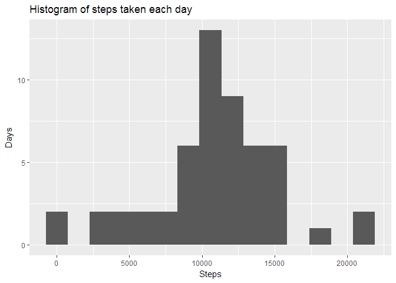
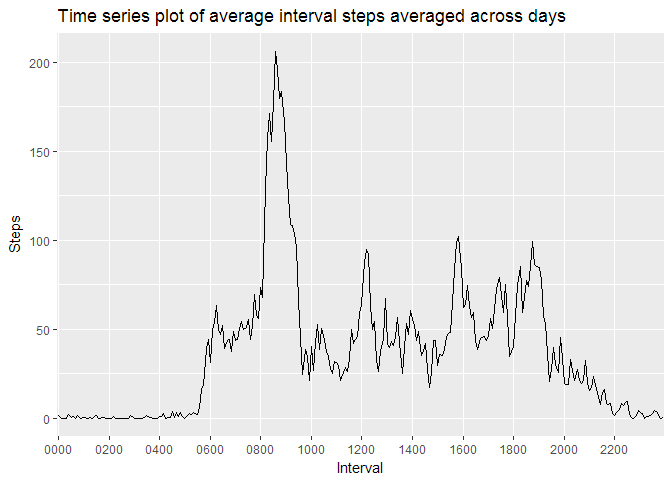
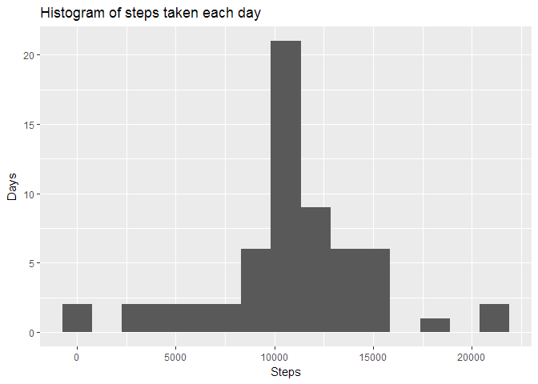
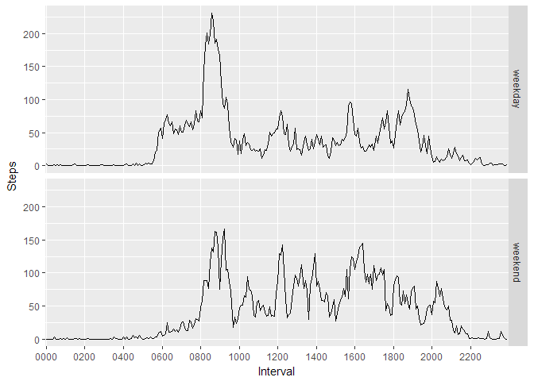

# Reproducible Research: Peer Assessment 1


## Loading and preprocessing the data


```r
library(stringi)
library(dplyr)
```

```
## 
## Attaching package: 'dplyr'
```

```
## The following objects are masked from 'package:stats':
## 
##     filter, lag
```

```
## The following objects are masked from 'package:base':
## 
##     intersect, setdiff, setequal, union
```

```r
library(ggplot2)

unzip(zipfile="activity.zip", exdir=".")
activity <- read.csv("activity.csv")
activity <- tbl_df(data.frame(
  steps = activity$steps,
  date = activity$date,
  interval = as.factor(stri_pad_left(activity$interval, width=4, pad="0"))
  ))
```

## What is mean total number of steps taken per day?

```r
dailysteps <- activity %>%
  group_by(date) %>%
  summarize(steps = sum(steps))
```


```r
ggplot(data=dailysteps, aes(x = steps)) +
  geom_histogram(bins = 15, na.rm=TRUE) +
  ggtitle("Histogram of steps taken each day") +
  xlab("Steps") +
  ylab("Days")
```

<!-- -->

Mean and median total number of steps taken per day

```r
mean(dailysteps$steps, na.rm=TRUE)
```

```
## [1] 10766.19
```

```r
median(dailysteps$steps, na.rm=TRUE)
```

```
## [1] 10765
```

## What is the average daily activity pattern?

```r
intervalsteps <- activity %>%
  filter(!is.na(steps)) %>%
  group_by(interval) %>%
  summarize(steps = mean(steps))
```


```r
ggplot(data=intervalsteps, aes(interval, steps, group=1)) +
  geom_path() +
  labs(x="Interval", y="Steps", title="Time series plot of average interval steps averaged across days") +
  scale_x_discrete(breaks=intervalsteps$interval[seq(1, 288, 24)])
```

<!-- -->

5-minute interval, on average across all the days in the dataset, which contains the maximum number of steps.

```r
as.character(intervalsteps$interval[which.max(intervalsteps$steps)])
```

```
## [1] "0835"
```

## Imputing missing values
Calculate and report the total number of missing values in the dataset.

```r
sum(is.na(activity$steps))
```

```
## [1] 2304
```

Devise a strategy for filling in all of the missing values in the dataset. We will use the mean for that 5-minute interval. Create a new dataset that is equal to the original dataset but with the missing data filled in.

```r
isteps <- mapply(function(date, interval, steps) {
  if (!is.na(steps)) {
    steps
  } else {
    intervalsteps$steps[which(intervalsteps$interval==interval)]
  }
}, activity$date, activity$interval, activity$steps)
activity <- activity %>% mutate(isteps)
```
Hstogram of the total number of steps taken each day (after filling in missing data)

```r
dailyisteps <- activity %>%
  group_by(date) %>%
  summarize(isteps = sum(isteps))
```


```r
ggplot(data=dailyisteps, aes(x = isteps)) +
  geom_histogram(bins = 15, na.rm=TRUE) +
  ggtitle("Histogram of steps taken each day") +
  xlab("Steps") +
  ylab("Days")
```

<!-- -->

Mean and median total number of steps taken per day

```r
mean(dailyisteps$isteps, na.rm=TRUE)
```

```
## [1] 10766.19
```

```r
median(dailyisteps$isteps, na.rm=TRUE)
```

```
## [1] 10766.19
```
The mean has not changed. The median is now the same as mean and is only slightly different from value
calculated without filled-in missing data.

Impact of imputing missing data (using the chosen method) is negligible for estimates of total daily number of steps.

## Are there differences in activity patterns between weekdays and weekends?

```r
daytype <- function (wday) {
  if (wday==0 | wday==6) {
    "weekend"
  } else {
    "weekday"
  }
}
daytype <- as.factor(sapply(as.POSIXlt(activity$date, format="%Y-%m-%d")$wday, daytype))
activity <- activity %>%
  mutate(daytype)
```

Panel plot containing a time series plot of the 5-minute interval (x-axis) and the average number of steps taken,
averaged across all weekday days or weekend days (y-axis).


```r
intervalstepswd <- activity %>%
  group_by(interval, daytype) %>%
  summarize(isteps = mean(isteps))
```


```r
ggplot(data=intervalstepswd, aes(interval, isteps, group=1)) +
  facet_grid(daytype ~ .) +
  geom_path() +
  labs(x="Interval", y="Steps") +
  scale_x_discrete(breaks=intervalsteps$interval[seq(1, 288, 24)])
```

<!-- -->

